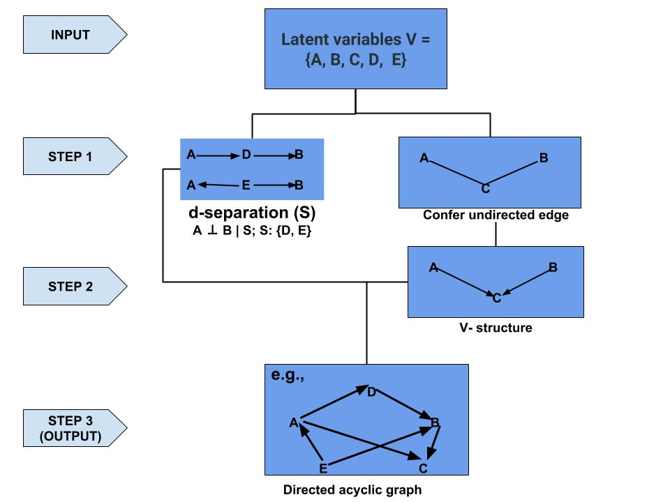
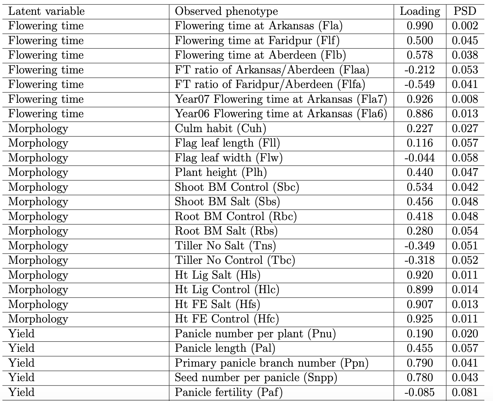
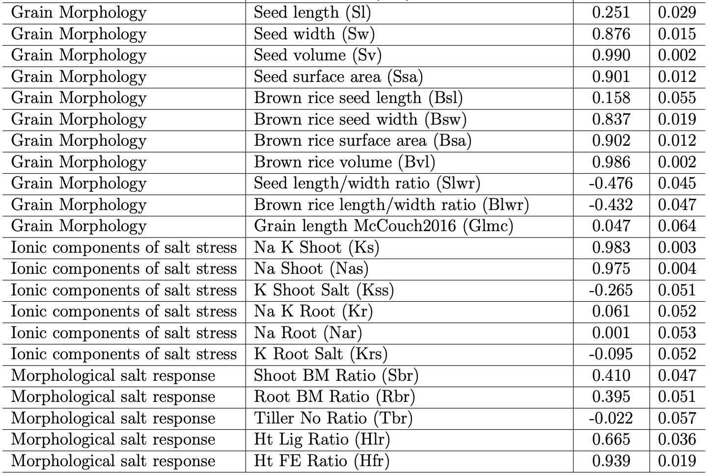
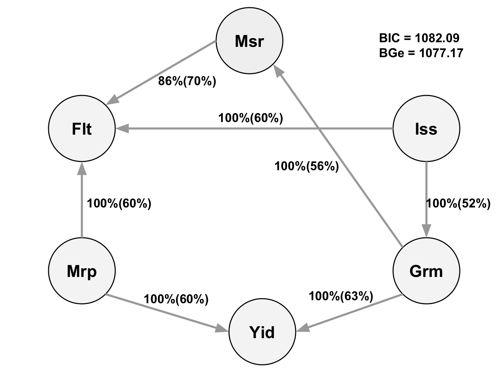
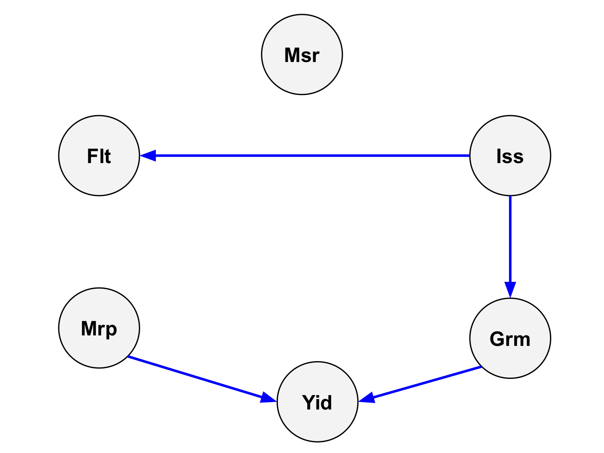

```{r setup, include=FALSE}
options(htmltools.dir.version = FALSE)

library(plotly)
library(tidyverse)
library(htmlwidgets)
```


# NSF funded project - wrchr.org 


---
# NSF funded project - wrchr.org 


---
# NSF funded project - wrchr.org 


---
# How to handle a large number of phenotypes?
More and more phenotypes are being generated across time and space


Challenges:
- high dimensional phenotypes
- diverse phenotypes
- how to make sense of these data and interpret
-  multi-trait linear mixed model is computationally challenging

Objective:
- use Bayesian confirmatory factor analysis and Bayesian
- network to characterize a wide spectrum of rice phenotypes

---
# Bayesian confirmatory factor analysis
Assume observed phenotypes are derived from  underlying latent variables

\begin{align*}
    \mathbf{T} =  \mathbf{\Lambda} \mathbf{F} + \mathbf{s}
\end{align*}
  
- $\mathbf{T}$ is the $t \times n$ matrix of observed phenotypes (413 accessions)

- $\mathbf{\Lambda}$ is the $t \times q$ factor loading matrix

- $\mathbf{F}$ is the $q \times n$ latent variables matrix

- $\mathbf{s}$ is the $t \times n$ matrix of specific effects.

\begin{align*}
    var\mathbf{(T)} &= \mathbf{\Lambda}\mathbf{\Phi}\mathbf{\Lambda}' + \mathbf{\Psi},
\end{align*}


- $\mathbf{\Phi}$ is the variance of latent variables

- $\mathbf{\Psi}$ is the variance of specific effects


---
# Define 6 latent variables from 48 phenotypes


1. Grain Morphology (Grm, 11)
    - Seed length (Sl), Seed width (Sw), Seed volume (Sv), etc
2. Morphology (Mrp, 14)
    - Flag leaf length (Fll), Flag leaf width (Flw), etc
3. Flowering Time (Flt, 7)
    - Flowering time in Arkansas (Fla), Flowering time in Aberdeen (Flb), etc}
4. Ionic components of salt stress (Iss, 6) 
    - Na shoot (Nas), K shoot salt (Kss), etc
5. Yield (Yid, 5)
    - Panicle number per plant (Pnu),   Panicle length (Pal), etc
6. Morphological salt response (Msr, 5)  
    - Shoot BM ratio (Sbr), Root BM ratio (Rbr), etc

---
# Study the genetics of each latent variable


---
# Multivariate analysis

1. Bayesian genomic best linear unbiased prediction
    - separate genetic effects from noise (44K SNPs)
    - $\mathbf{F} = \boldsymbol{\mu} + \mathbf{Xb} + \mathbf{Zu} + \boldsymbol{\epsilon}$

2. Bayesian network
    - interrelationship among latent variables
    - genetic selection for breeding requires causal assumptions


---
# Constraint-based learning



---
# Standardized factor loadings


---
# Standardized factor loadings



---
# Genetic correlations among latent variable


---
# Hill Climbing algorithm



---
# Tabu algorithm


---
# Max-Min Hill Climbing algorithm


---
# General 2-Phase Restricted Maximization algorithm


---
# Consensus Bayesian network


---
# Paper - 10.1534/g3.119.400154


---
# FA vs. PCA

- What is the main difference between principal component analysis (PCA) and factor analysis (FA)? 

- Confirmatory factor analysis (CFA) vs. Explanatory factor analysis (EFA)


---
# Summary

- Bayesian cofirmatory factor analysis allows to work at the
level of latent variables

- Bayesian network can be applied to predict the potential influence of external interventions or selection associated with target traits

- Provide greater insights than pairwise-association measures of multiple phenotypes

- It is possible to dissect genetic signals from high-dimensional phenotypes if we focus on underlying patterns in big data


